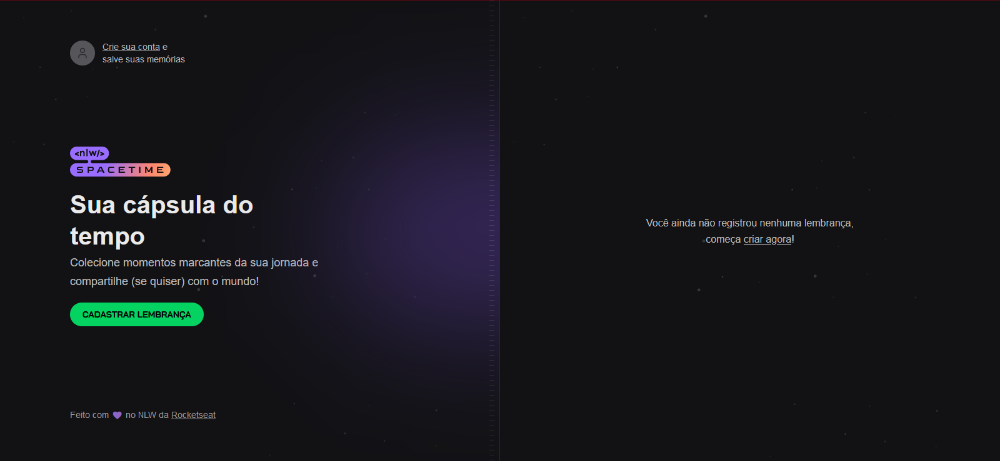

# Cápsula do tempo

  

  

  
  

  

Aplicação de recordação de memórias, onde o usuário poderá adicionar à uma timeline textos, fotos e vídeos de acontecimentos marcantes da sua vida, organizados por mês e ano.

## Sobre o projeto

O projeto está sendo desenvolvido pela Rocketseat no evento de programação chamado NLW Spacetime.

## Tecnologias

### front-end

- [ReactJS](https://reactjs.org/)
- [NextJS](https://nextjs.org/)
- [TailwindCSS](https://tailwindcss.com/)
- [Lucide](https://lucide.dev/)

### back-end

- [Fastify](https://www.fastify.io/)
- [Prisma](https://www.prisma.io/)
- [Zod](https://zod.dev/)

## Screenshots

